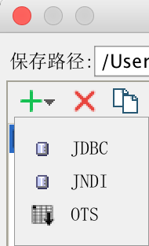
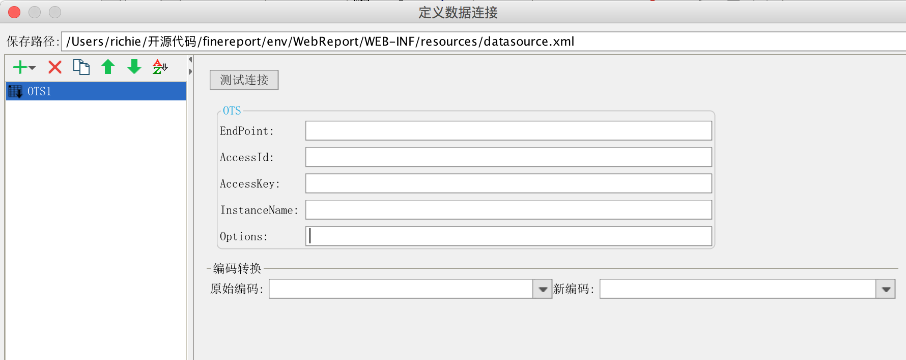
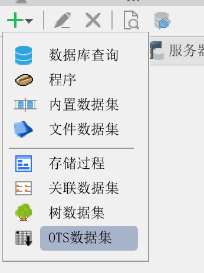
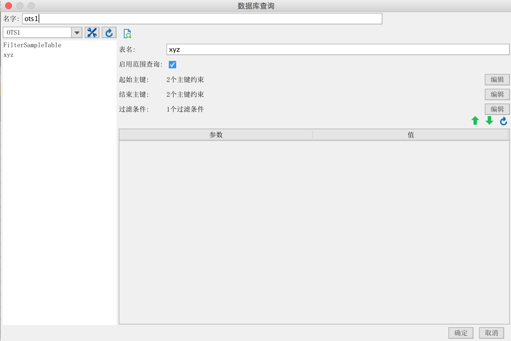
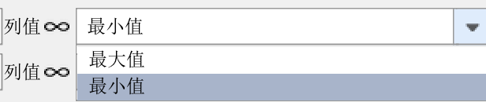
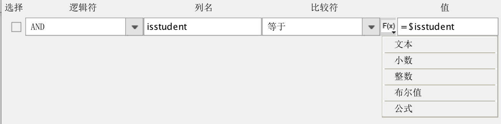
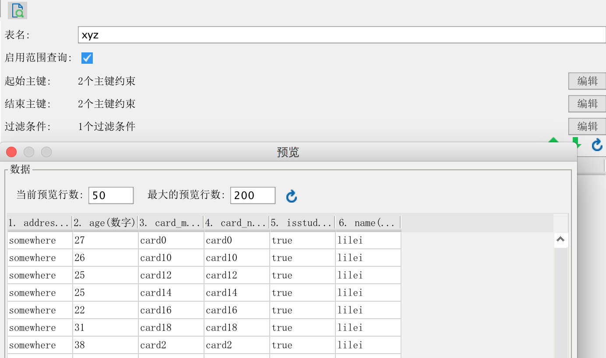

# 帆软报表连接阿里云OTS数据库的插件
OTS数据库是阿里云提供的一款NoSQL数据库，提供海量结构化数据的存储和实时访问。帆软报表原生不支持从OTS数据库中获取数据并展示，但是提供了开发API，可以开发插件用以支持从OTS取数并展示。
## 插件编译
将帆软报表安装目录下的相关jar包:

$installDir/fr-designer-core-8.0.jar

$installDir/fr-designer-chart-8.0.jar

$installDir/fr-designer-report-8.0.jar

$installDir/WebReport/WEB-INF/lib/fr-core-8.0.jar

$installDir/WebReport/WEB-INF/lib/fr-chart-8.0.jar

$installDir/WebReport/WEB-INF/lib/fr-report-8.0.jar

$installDir/WebReport/WEB-INF/lib/fr-platform-8.0.jar

$installDir/WebReport/WEB-INF/lib/fr-third-8.0.jar

拷贝到项目工程的lib/report目录下（如果没有该目录则自行新建）

然后执行ant命名来编辑插件包：
`ant -f build.xml jar`

## 插件安装
使用帆软设计器自带的插件管理器即可安装。
## 插件使用
### 新建数据连接
安装完插件后，在新建数据连接的地方可以看到OTS类型的数据连接：



点击新建后可以看到如下的界面：



按实际的配置填写上即可。

注意：如果使用了HTTP代理的话，需要修改resources下的ots.xml，默认内容如下：

```lang=xml
<?xml version="1.0" encoding="UTF-8" standalone="no"?>
<Config enable="false">
    <ProxyPort>12</ProxyPort>
    <ProxyHost>abs</ProxyHost>
    <ProxyUsername>u</ProxyUsername>
    <ProxyPassword>p</ProxyPassword>
    <ProxyDomain>d</ProxyDomain>
    <ProxyWorkstation>w</ProxyWorkstation>
    <UserAgent>a</UserAgent>
</Config>
```
如果要使用HTTP代理，需要修改enable属性为true，并且修改其他的几个属性为实际值。
### 新建数据集
在模板数据集添加的地方会出现OTS数据集：




点击后会进入OTS数据集的设计界面：



输入相应的表名和其他约束信息即可。

注意：起始主键和结束主键的约束区间必须是闭合的（左开右闭）。
到这里，一个最基本的OTS数据集就新建好了。

### 范围查询
范围查询是指不查询特定的一个值，而是查询从起点到终点的条件对应的值。
对于字符串类型的主键，可以选择“最值”：



起始主键设置列值为“最小值”，结束主键设置列值为“最大值”，即可查询出该主键的所有值。
对于整数类型的主键，可以直接输入特定的数字即可，当然也可以使用最值。
注意：OTS数据库查询的时候，需要设定该数据库的所有主键的值，比如有4个主键，那么在主键设置的地方就需要添加4个主键的查询范围。

### 过滤条件
过滤条件可以针对不同的列进行过滤，支持多个条件以AND，OR进行合并查询：




### 预览效果
设定好主键和查询条件后，就可以预览数据集结果了：


